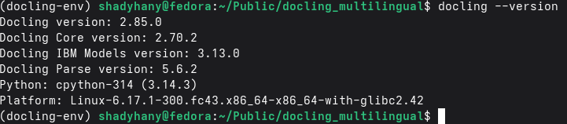
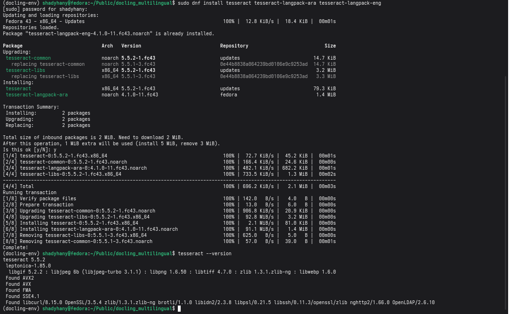

This repository documents my attempt at this [issue or task](https://forge.fedoraproject.org/commops/interns/issues/123).

The issue discription divides the task into **6** steps:

1. install docling with an OCR engine package of your choice, using python package manager (you can add it as an extra while installing docling, or install the OCR engine independently)

2. Display the version of docling installed
3. Display the version of OCR engine installed
4. Find a scanned non-English document, or a multilingual one.
5. Use the Docling CLI to convert the document to markdown (or html), pay attention to the command line options needed to specify the languages used by the OCR engine.

6. Try a couple of other command line options to compare results 


##  My OS information:


## Step 1: Installation & Verification

- I verified **Python** and **pip**:

```bash
shadyhany@fedora:~/Public/docling_multilingual$ python --version && pip --version
Python 3.14.3
pip 26.0.1 from /home/shadyhany/Public/docling_multilingual/docling-env/lib64/python3.14/site-packages/pip (python 3.14)
```

- I then created a virtual envirnoment to keep the project isolated and activated the venv:

```bash
shadyhany@fedora:~/Public/docling_multilingual$ python3 -m venv docling-env
shadyhany@fedora:~/Public/docling_multilingual$ source docling-env/bin/activate
(docling-env) shadyhany@fedora:~/Public/docling_multilingual$ 
```


- I then installed **docling** using **pip** latest version:


- **OCR Enginge:**

I chose an independent engine installation using **Tesseract**. It is highly stable for system-wide multilingual document processing and offers mature language packs for Right-to-Left (RTL) scripts, which is essential for this Arabic document.

On Fedora, I installed the core Tesseract engine along with the necessary language packs for Arabic (`tesseract-langpack-ara`) and English (`tesseract-langpack-eng`):
```bash
sudo dnf install tesseract tesseract-langpack-ara tesseract-langpack-eng
```


## Step 2: Installed Docling Version


## Step 3: Installed OCR engine Version


## Step 4: The scanned non-English document.
I collected a 4-page document from an Arabic academic scanned text focusing on statistical time-series analysis. I deliberately chose this document because it presents a complex, non-trivial parsing challenge that thoroughly tests the OCR engine's limits. It requires the engine to switch between Right-to-Left (RTL) Arabic script and Left-to-Right (LTR) English terminology and numbers.
This short document I used contains:
- **multilingual text**: (rtl and ltr) that needs to be positioned carfully
- **Data Charts**: requires layout recognition to extract accurately
- **Math Notation**: Equations and variables (requires correct formating latex & Markdown)
- **multi-column tables**: Requires data extraction capabilities
 