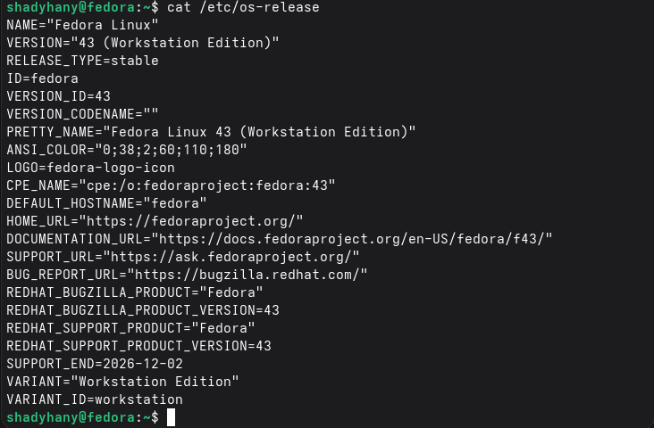
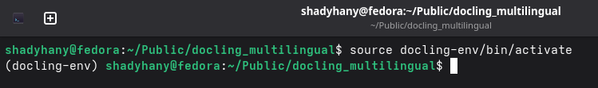
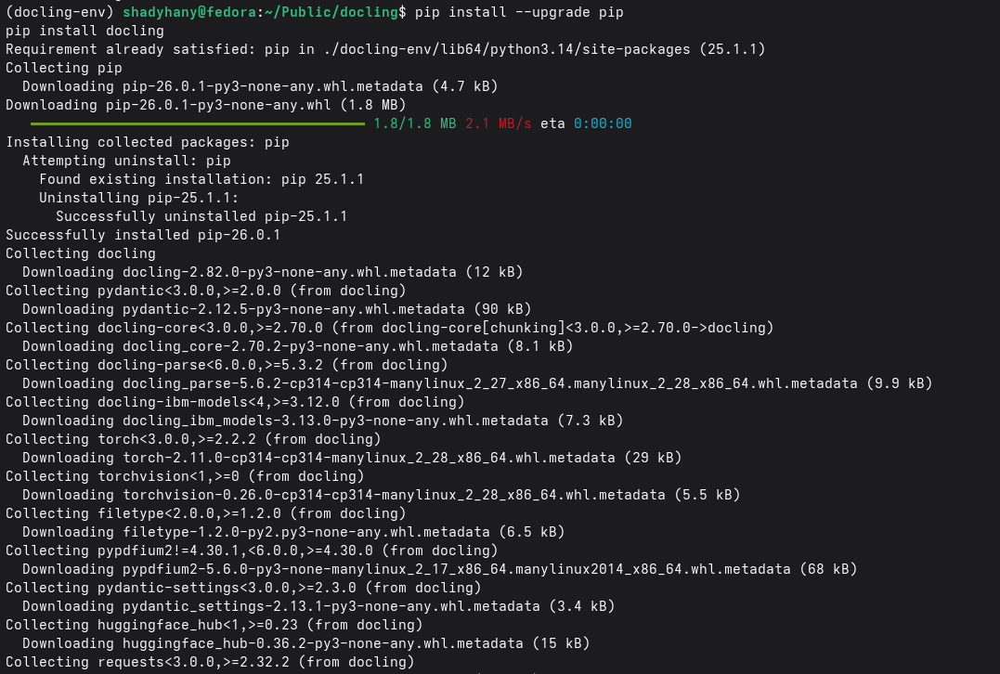
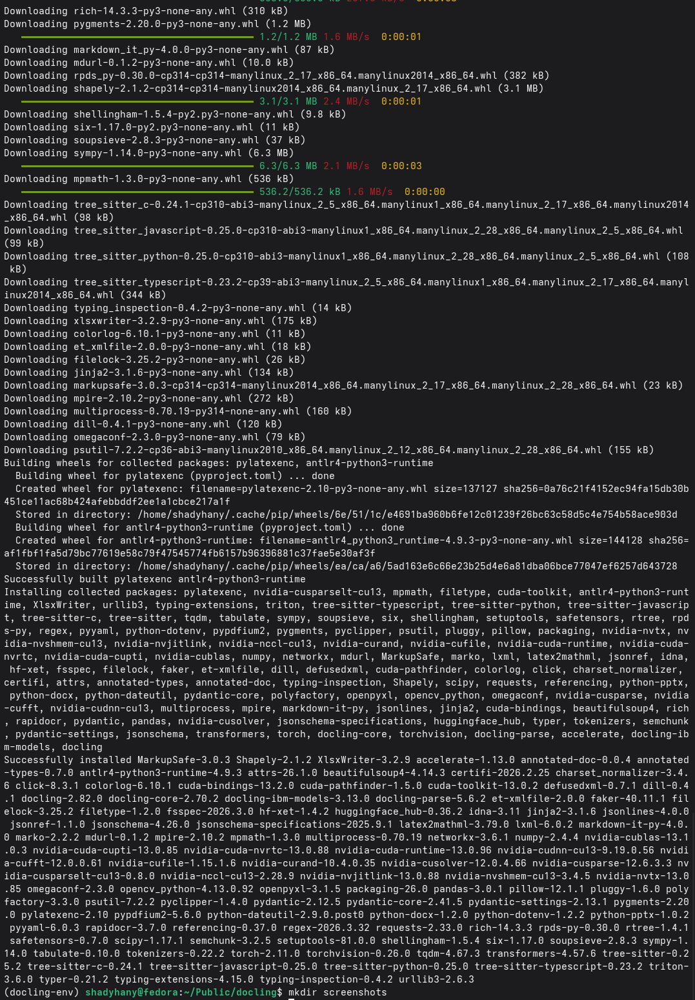

This repository documents my attempt at this [issue or task](https://forge.fedoraproject.org/commops/interns/issues/123).

The issue discription divides the task into **6** steps:

1. nstall docling with an OCR engine package of your choice, using python package manager (you can add it as an extra while installing docling, or install the OCR engine independently)

2. Display the version of docling installed
3. Display the version of OCR engine installed
4. Find a scanned non-English document, or a multilingual one.
5. Use the Docling CLI to convert the document to markdown (or html), pay attention to the command line options needed to specify the languages used by the OCR engine.

6. Try a couple of other command line options to compare results 


##  My OS information:



## Step 1: Installation & Verification

- I verified **Python** and **pip**:

```bash
shadyhany@fedora:~/Public/docling_multilingual$ python --version && pip --version
Python 3.14.3
pip 26.0.1 from /home/shadyhany/Public/docling_multilingual/docling-env/lib64/python3.14/site-packages/pip (python 3.14)
```

- I then created a virtual envirnoment to keep the project isolated and activated the venv:

```bash
shadyhany@fedora:~/Public/docling_multilingual$ python3 -m venv docling-env
shadyhany@fedora:~/Public/docling_multilingual$ source docling-env/bin/activate
(docling-env) shadyhany@fedora:~/Public/docling_multilingual$ 
```




- I then installed **docling** using **pip**:






- **OCR Enginge:**
